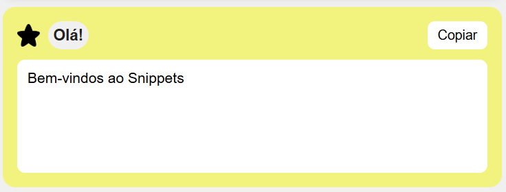
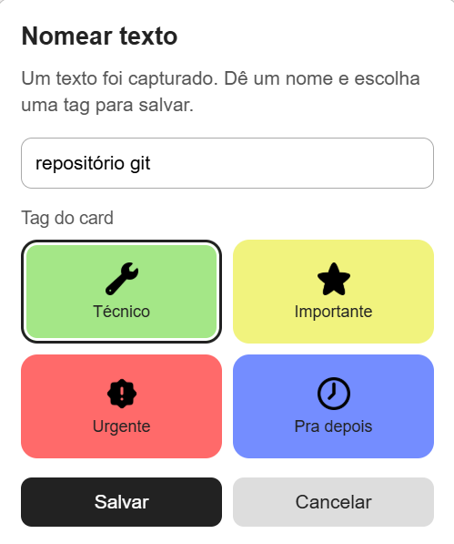
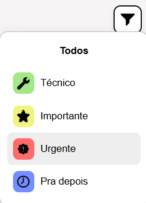
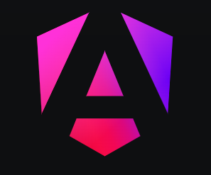
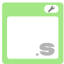
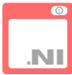

# Snippets

Projeto desenvolvido por Jean Martins, tem como função demonstrar como seria se pudessemos copiar, salvar e editar textos a partir de um novo atalho.



## Utilizando...

Ao colar um texto dentro do cartão de captura,

```Aperte Alt + C
```
que um pequena janela se abra para rapidamene editar o novo cartão de colagem, podendo somente colocar um nome ou, também, adicionar um selo para melhor identificação do cartão a ser salvo.



## Público alvo

Snippets tem como público, usuários que movimentam grandes quantidades de textos, linhas de código, etc.
Usuários que necessitam de um espaço claro e objetivo, não somente para deixar salvo suas colagens,

```Mas, principalmente, para organizar suas ferramentas de maneira simples e moderna.
```

## Filtrar

O projeto conta com um filtro ráído podendo escolher entre 1 (uma) das 4 (quatro) opções de categorias

```Basta clicar no ícone de funil no canto superior direito da área de cartões, exemplo a seguir:  
```


---

## Construção do projeto

O projeto foi inteiramente programado a partir do framework Angular. Pois, oferece uma infinidade 
de funções e ferramentas para a criação de demos para exibições.



## Recursos adicionais

Para mais informações em usar o Angular CLI, incluindo referencias detalhadas em comandso, visite a página [Angular CLI Overview and Command Reference](https://angular.dev/tools/cli).

---

## Muito obrigado por participar deste projeto comigo!!


